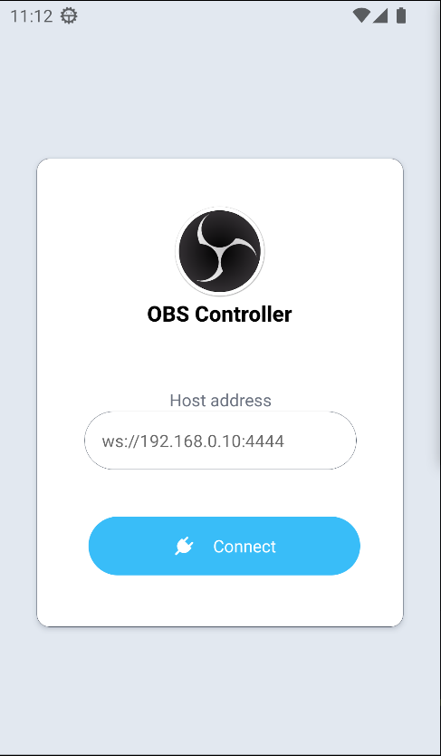
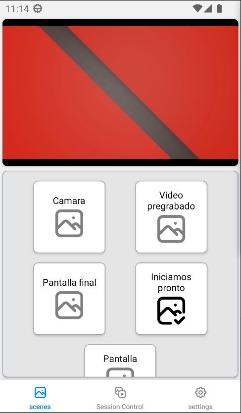
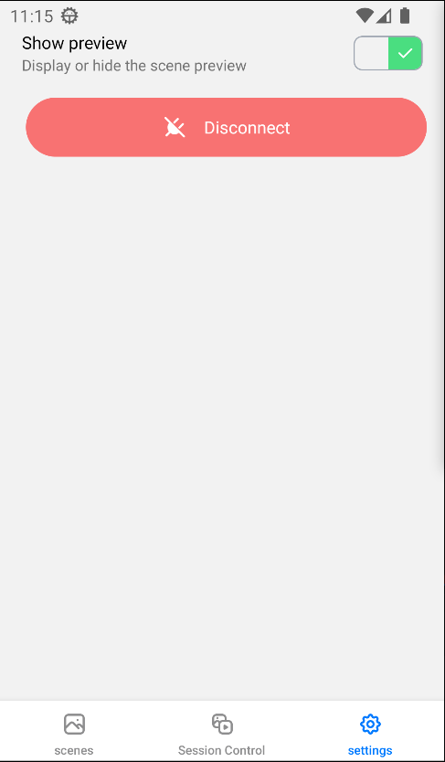

# Obs Android Controller

OBS web controller developed using

- [React Native](https://reactnative.dev/)
- [Expo](https://expo.dev/)
- [NativeWind](https://www.nativewind.dev/)
- [OBS-Websocket-js](https://github.com/obs-websocket-community-projects/obs-websocket-js)
- [Zustand](https://zustand.docs.pmnd.rs/getting-started/introduction)

## Pictures

### Login

### Scenes

### Streaming and recording

### Settings

